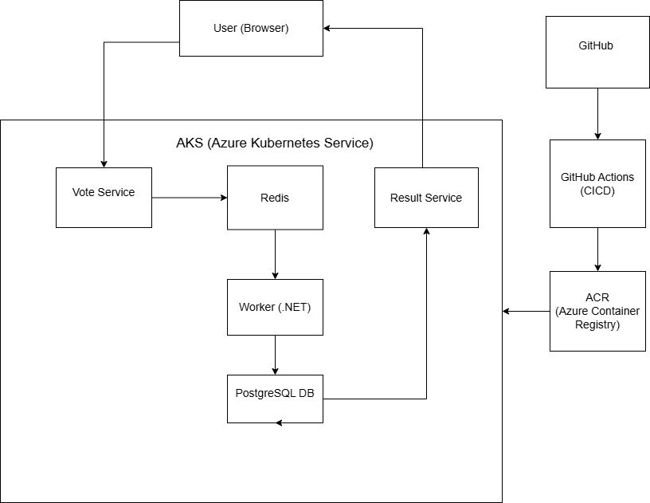

# Production-Ready Voting App Deployment using AKS, Terraform & CI/CD

## Description
 
This project demonstrates the deployment of a production-ready 3-tier microservices voting application using Azure Kubernetes Service (AKS), Azure Container Registry (ACR), Terraform, and CI/CD pipelines.
 
The application consists of multiple services including vote, result, worker, Redis, and PostgreSQL, deployed using Kubernetes.
 
## Architecture
 
- User interacts with Vote Service (Python frontend)
- Votes are stored temporarily in Redis
- Worker service (.NET) processes votes and stores them in database
- Data is stored in PostgreSQL database
- Result service (Node.js) displays results
 
Deployment Flow:
GitHub → CI Pipeline → Docker Image → ACR → AKS → Application

##  Architecture Diagram

 
## Tech Stack
 
- Cloud: Azure (AKS, ACR)
- IaC: Terraform
- Containerization: Docker
- Orchestration: Kubernetes (AKS)
- CI/CD: GitHub Actions
- Languages:
  - Python (Vote)
  - Node.js (Result)
  - .NET (Worker)
- Database: PostgreSQL
- Cache/Queue: Redis
 
## Implementation Steps
 
1. Created AKS Cluster using Terraform
2. Created Azure Container Registry (ACR)
3. Connected AKS with kubectl
4. Deployed voting app using Kubernetes manifests
5. Exposed services using LoadBalancer
6. Verified application access via public IP
7. Set up CI pipeline using GitHub Actions
8. Built Docker image and pushed to ACR
9. Deployed updated images to AKS
 
## CI/CD Workflow
 
- Code pushed to GitHub repository
- GitHub Actions pipeline triggered
- Docker image built automatically
- Image pushed to Azure Container Registry (ACR)
- Kubernetes pulls latest image and updates pods
 
## Issues & Fixes
 
Issue:
Changes were not reflecting in the application.
 
Reason:
Kubernetes was using old Docker image due to image not being rebuilt and pushed.
 
Temporary Fix:
Updated code inside running pod using kubectl exec.
 
Permanent Fix:
Need to Rebuilt Docker image and pushed to ACR via CI/CD pipeline to ensure updates reflect properly.
 
## Demo Flow
 
- Make a code change (UI update)
- Push code to GitHub
- CI pipeline triggers automatically
- New Docker image is built and pushed to ACR
- AKS pulls updated image
- Changes reflect in browser
- kubenetes automatically updates pods with new image
 
## Conclusion
 
This project demonstrates end-to-end DevOps workflow including infrastructure provisioning, containerization, CI/CD automation, and Kubernetes deployment.
 
